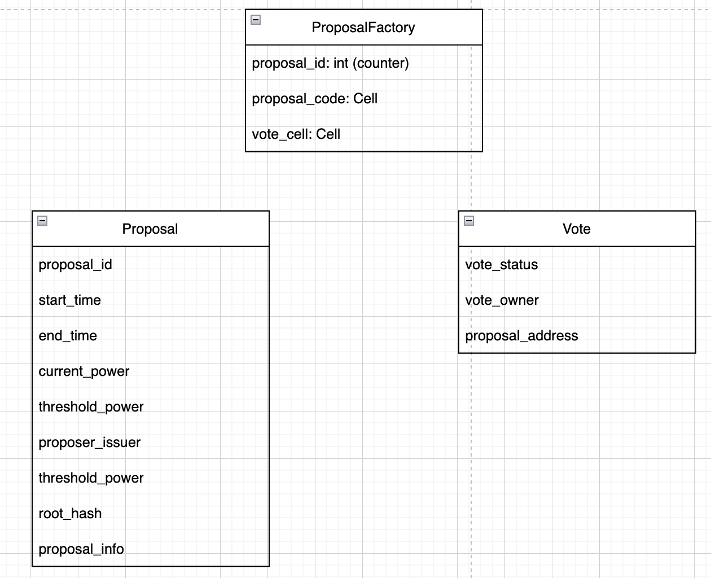
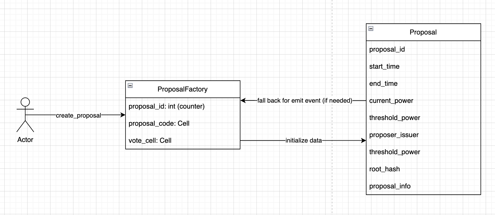
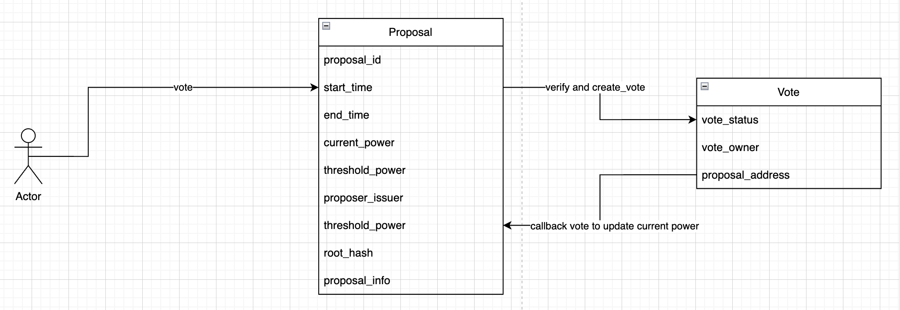

### What is this repo ?
- This repo is simple implementation of vote. It only shows the working flow of simple voting system.

### Continuing thoughts after interview

- When drawing vote contract, i just think about how proposal can verify vote of user, and how to detect the user is in a whitelist or not.
- At that time, my brain is kind of frozen, so i can't figure it out.
- Right after the interview, i think about it again, and i rethink about it. There are two problems we need to solve:
  - How to extend the size of whitelist users, since dict has limited size. => Then i found out merkle tree.
  - How to verify the vote of user, since we can't store all the votes. => verify proof with user address, then we will create vote contract for user, from that vote contract, we can define the vote power of user like double-vote, unvote, revote, etc.

=> That's the think, but we can't make sure how much user can reach. So this project is a poc for that. With merkle tree, we can work with large size of whitelist users. like 1 million.

On the merkle tree, i use my own merkle tree implementation version, but i think there is another better way is using exotic cell. But to be honest, i haven't used that before, and don't know about the limit of it, so on this simple version, we use my self-implemented merkle tree.

The test is on `tests/core/full-flow.test.ts`.

There are another things that i have not implemented since it is simple one are:

- the fee for the liveness of vote contract to reduce fee. With 1000000 users, the fee for tx is less than 0.05 TON (~around 0.03). 
- execution for proposal when vote is passed, other functions related to business logic.
- refund fee for user when finish execution or in error.
- add more other validation checks.
- take test about the fee when using exotic cell, find out the beautiful of it.

# Components



- **Proposal Factory** - Creates proposals with unique IDs and predictable addresses for easy query and indexing data.
- **Proposal** - Manages individual proposal voting with Merkle proof verification and time controls
- **Vote** - Tracks each user's vote per proposal, prevents double voting, allows vote changes

# Flow

## Create a proposal



- 1: User init message op::create_proposal to Proposal Factory Contract.
- 2: Proposal Factory contract will send internal message op::initialize to Proposal with state init to deploy Proposal contract, and set some values to storage.
- 3: Proposal contract may fall back to Proposal Factory to emit event from Proposal Factory contract for easier indexer.

## Vote for a proposal



- 1: User init message op::vote to deployed Proposal contract with proof.
- 2: Proposal contract will verify merkle tree by calculating sender address and proof, then compare root hash. If true, send internal message op::init_vote to Vote contract along with state init to deploy it.
- 3: Vote contract will calculate voting power, then send back to proposal contract for updating current_power.

# How to run the code:

```bash
yarn install
```

```bash
yarn test tests/core/full-flow.test.ts
```
