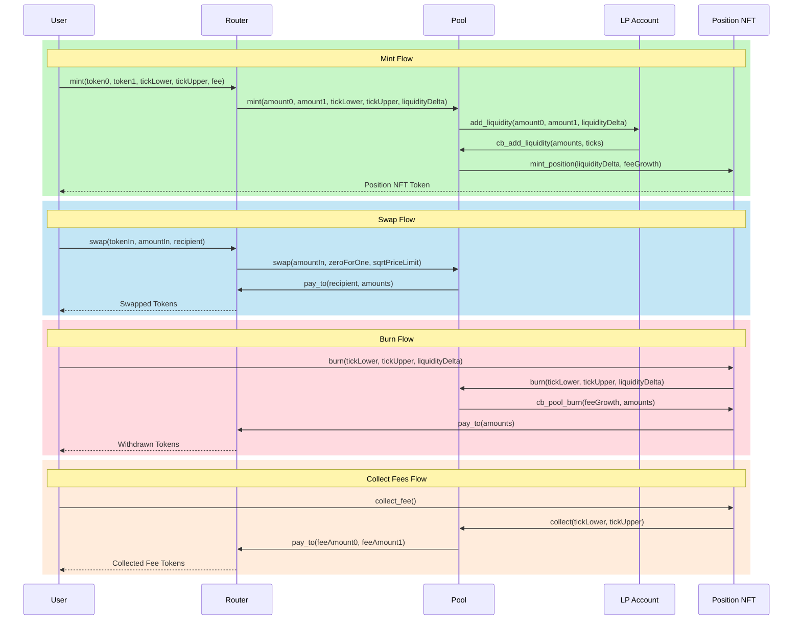

# OrbitTON

## Project structure

- `contracts/` - Source code in [FunC](https://docs.ton.org/develop/func/overview)
- `wrappers/` - TypeScript interface classes for all contracts (implementing `Contract` from [@ton/core](https://www.npmjs.com/package/@ton/core))
  - include message [de]serialization primitives, getter wrappers and compilation functions
  - used by the test suite and client code to interact with the contracts from TypeScript
- `compilables/` - Compilations scripts for contracts
- `tests/` - TypeScript test suite for all contracts (relying on [Sandbox](https://github.com/ton-org/sandbox) for in-process tests)
- `scripts/` - Deployment scripts to mainnet/testnet and other scripts interacting with live contracts
- `build/` - Compilation artifacts created here after running a build command

## Contract Interactions

The CLAMM (Concentrated Liquidity Automated Market Maker) system consists of four main contracts that interact to provide liquidity management and token swapping functionality:

### Core Components

- **Router**: The entry point contract that handles user requests and routes them to appropriate contracts
- **Pool**: Implements the core AMM logic, price calculations, and liquidity management
- **LP Account**: Manages individual liquidity positions and their associated state
- **Position NFT**: Non-fungible token representing ownership of liquidity positions

### Protocol Operations

The diagram below illustrates the interaction flow between contracts for the main protocol operations:

1. **Mint**: Users provide liquidity within a specific price range
   - Router validates and forwards mint request
   - Pool creates LP Account if needed
   - Position NFT is minted to represent the liquidity position

2. **Swap**: Users exchange one token for another
   - Router handles token transfers and swap parameters
   - Pool executes the swap using available liquidity
   - Tokens are transferred to the recipient

3. **Burn**: Users remove their liquidity from a position
   - Position NFT contract validates ownership
   - Pool calculates and returns token amounts
   - Router handles final token transfers

4. **Collect**: Users harvest their accumulated trading fees
   - Position NFT verifies fee collection request
   - Pool calculates accumulated fees
   - Router transfers fee tokens to the user

## How to use

### Build

`npx blueprint build` or `yarn blueprint build`

### Test

`npx blueprint test` or `yarn blueprint test`

### Deploy or run another script

`npx blueprint run` or `yarn blueprint run`

### Add a new contract

`npx blueprint create ContractName` or `yarn blueprint create ContractName`
